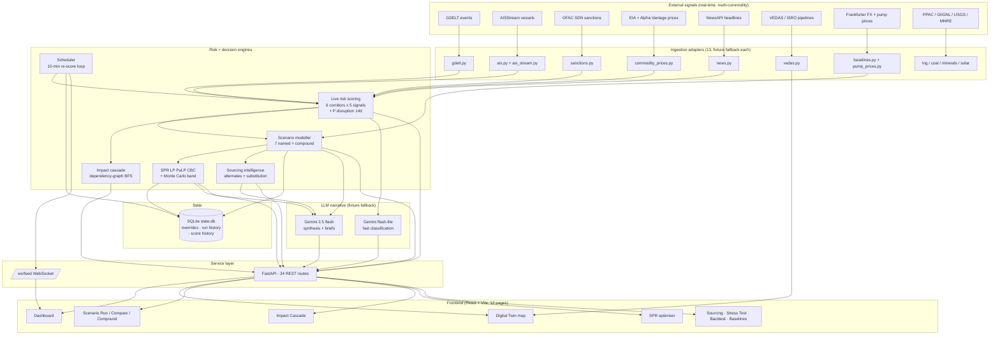

# Architecture diagram

Two renderings of the system architecture for the presentation deck — Mermaid (for digital slides) and ASCII (for export). Both describe the same system.

## Mermaid



## ASCII fallback

```
External signals (real-time, multi-commodity)
+-------+ +-----+ +------+ +--------+ +---------+ +-------+ +----------+ +-----------+
| GDELT | | AIS | | OFAC | | EIA/AV | | NewsAPI | | VEDAS | | FX/pump  | | PPAC/USGS |
+---+---+ +--+--+ +--+---+ +---+----+ +----+----+ +---+---+ +----+-----+ +-----+-----+
    v        v        v         v          v          v          v             v
+------------------------------------------------------------------------------------+
| Ingestion adapters (13, each with fixture fallback)                                 |
| gdelt  ais+ais_stream  sanctions  commodity_prices  news  vedas  baselines          |
| pump_prices  lng  coal  minerals  solar                                             |
+----+---------------------------------------------------------------+---------------+
     v                                                               v
+---------------------------------------------------+   +---------------------------+
| Live risk scoring: 6 corridors x 5 signals         |   | Scheduler: 10-min tick    |
| 0.35 geo + 0.20 ais + 0.15 sanc + 0.15 px + 0.15 nw|<--| -> SQLite score_history   |
| -> score, tier, P(disruption 14d)                  |   | -> WS score_update push   |
+-----+-----------------+--------------------+-------+   +---------------------------+
      v                 v                    v
+------------+ +-------------------+ +---------------------+ +---------------------+
| Scenario   | | SPR LP (PuLP CBC) | | Sourcing intel      | | Impact cascade      |
| modeller   | | + Monte Carlo     | | alternates, subst., | | dependency-graph    |
| 7 named +  | | p10/p50/p90 band  | | LLM analysis        | | BFS, hop decay 0.85 |
| compound   | | + decision brief  | |                     | |                     |
+-----+------+ +-----+-------------+ +----+----------------+ +--+------------------+
      |              |                    |                     |
      +------+-------+---------+----------+----------+----------+
             v                 v
   +--------------------+   +--------------------------------------------------+
   | SQLite state.db    |   | Gemini narrative (2.5 flash + flash-lite, cached, |
   | overrides + runs   |   | fixture fallback)                                 |
   +--------------------+   +-----------------------+---------------------------+
                                                    v
+------------------------------------------------------------------------------------+
| FastAPI: 34 REST routes (/scores /scenarios /compound /cascade /sourcing /spr      |
| /baselines /backtest /stress-test /feed /chat ...)  +  /ws/feed WebSocket          |
+---------+----------+-----------+----------+-----------+----------+-----------------+
          v          v           v          v           v          v
     +---------+ +--------+ +---------+ +---------+ +-------+ +-----------------+
     |Dashboard| | Twin   | |Scenario | | Cascade | | SPR   | | Sourcing/Stress |
     |         | | map    | |Run/Comp | |         | | optim | | Backtest/Basel. |
     +---------+ +--------+ +---------+ +---------+ +-------+ +-----------------+
```

## Component key

| Component | Role |
|-----------|------|
| Ingestion adapters | One per data source, 13 total. Async, fixture fallback when `ALLOW_LIVE_INGEST=false` or a live call fails. |
| Live risk scoring | Composite 0-100 per corridor (6 corridors). Weights: 35% geopolitical, 20% AIS anomaly, 15% sanctions, 15% price volatility, 15% news sentiment. Emits tier + 14-day disruption probability. |
| Scheduler | Background task re-scoring every 10 min; persists history to SQLite; pushes score-change frames over `/ws/feed`. |
| Scenario modeller | 7 named scenarios (crude, LNG, coal, rare earths, solar, uranium), single or compound (2-4 at once). `project_scenario()` maps intensity x duration to prices, GDP bps, SPR runway, and sector trajectories. |
| SPR LP solver | PuLP CBC. Decision vars: daily drawdown and replenish. Objective: minimise integrated price impact. Monte Carlo band (200 samples, p10/p50/p90) + policymaker decision brief on top. |
| Sourcing intelligence | Ranks alternative suppliers by current risk + historical share + lead time; demand substitution options. Honest about NOT validating refinery / smelter chemistry. |
| Impact cascade | Dependency-graph BFS from any cause to every downstream Indian sector and macro variable, hop-decay severity. |
| SQLite persistence | `state.db`: baseline overrides (survive restart), scenario-run + SPR-run audit history, score history. |
| LLM narrative | Gemini 2.5 flash for synthesis (briefs, scenario stories, recommendations); flash-lite for high-frequency classification. LRU-cached, fixture fallback. |
| FastAPI | 34 camelCase REST routes + `/ws/feed`. Fixture fallback keeps the whole surface serving offline. |
| Frontend | React + Vite + TS + Tailwind (`op-*` tokens). 12 pages. Leaflet twin with pipeline/vessel/imagery layers. Recharts. Zustand. |

## Data flow — Hormuz disruption end-to-end

```
1. GDELT picks up "US tanker incident in Strait of Hormuz" within 15 min of publication.

2. ingest/gdelt.py extracts: actor1=US, actor2=Iran, location=Hormuz, lat=26.5, lon=56.2,
   tone=-7.2, cameo_code=144 (THREATEN_FORCE).

3. engines/live_scores computes Hormuz from five live signals:
   geo 0.72, ais 0.55, sanctions 0.30, price_vol 0.65, news 0.60
   composite = 0.35*0.72 + 0.20*0.55 + 0.15*0.30 + 0.15*0.65 + 0.15*0.60
             = 0.6395  -> score 64  -> tier "high"
   The scheduler's next tick persists the snapshot and pushes a score_update
   frame over /ws/feed; the dashboard card recolors without a refresh.

4. engines/scenarios.project_scenario("hormuz_partial_closure", 0.5, 14) returns:
   Brent 82 -> ~91.5 (+11.6%), SPR cover 9.5d -> ~8.3d, GDP ~ -23 bps, plus
   per-day refinery run-rate / diesel / power-stress / GDP trajectories.

5. engines/spr_lp.solve_spr_plan() runs with the projected supply gap;
   spr_uncertainty wraps it in a 200-sample p10/p50/p90 band. The run is
   persisted to state.db (visible at /api/spr/runs).

6. llm.LLMClient.narrate_scenario(result) calls Gemini 2.5 flash with the
   structured projection. Returns an analyst narrative + recommended actions
   (pre-canned fixture text when offline).

7. POST /api/scenarios/hormuz_partial_closure/run returns the projection +
   narrative in one camelCase JSON response; the run lands in scenario_runs.

8. Frontend ScenarioRun renders impact bars, the market timeline, the sector
   trajectory chart, cost-of-inaction strip, and the narrative panel.
   End-to-end latency: under 2 s on fixtures; the LLM call dominates when live.
```
